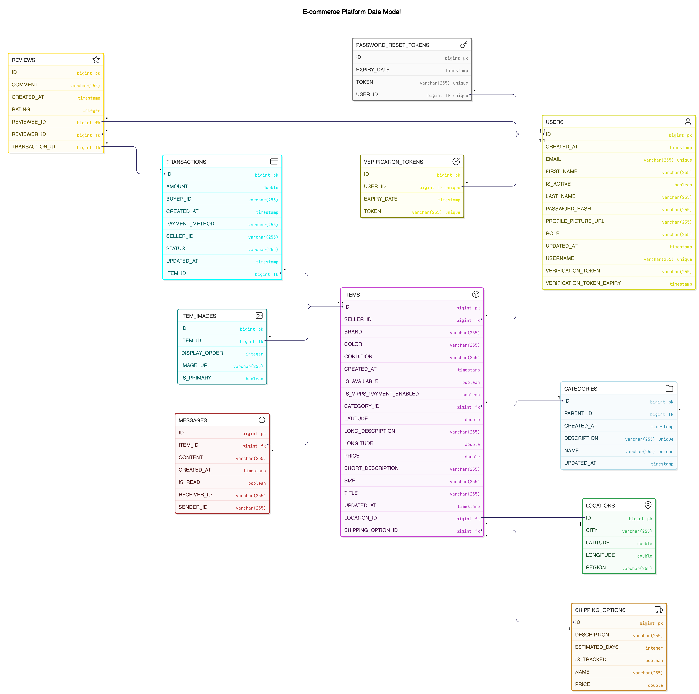

# IDATT2105 - Semester Project 2025

## 📌 Project Description

A modern full-stack web-based marketplace inspired by Finn.no, developed for the IDATT2105 Full-stack Application Development course (Spring 2025). 
The platform allows users to securely buy and sell second-hand or new items, and includes features like:

- 🔍 Advanced search and filtering
- 💬 Real-time messaging
- 🔐 JWT-based authentication
- 🛠️ Admin dashboard

Built with **Vue 3** (frontend) and **Spring Boot 3** (backend), deployed to **Netlify** and **Heroku** with PostgreSQL in production.

The system emphasizes clean architecture, security (OWASP compliance), accessibility, RESTful design, test coverage, and CI/CD integration.


**Live demo:** [clozet.netlify.app](https://clozet.netlify.app/)

## Table of Contents
1. [Introduction](#introduction)
2. [Technology Choices and Justifications](#technology-choices-and-justifications)
3. [Application Structure](#application-structure)
4. [Security and Authentication](#security-and-authentication)
5. [API Documentation](#api-documentation)
6. [Installation and Running](#installation-and-running)
7. [Testing and CI/CD](#testing-and-cicd)
8. [Usage Examples](#usage-examples)
9. [Project Members](#project-members)

## Introduction
Explain what the project is about and what it aims to solve. Consider including:

- Background of the project

This project was developed as a semester project in IDATT2105. The goal is to recreate the core concept of a digital marketplace with modern tools and best practices.

Students participating are graded on their implementation of:
- Clean and maintainable code
- Functional and responsive UI
- Secure backend with authentication and validation
- High test coverage and robust CI/CD


## Core Functionalities

### User Management & Authentication
- 👤 User registration and profile management
- 🔐 Secure login with JWT and Spring Security
- 👥 Role-based access control (Admin/Standard users)
- 🌐 Internationalization (i18n) support

### Listing Management
- 📝 Create, update, delete, and archive item listings
- 📸 Multi-image gallery support for listings
- 📱 Responsive thumbnail grid for item exploration

### Search & Discovery
- 🔍 Advanced filtering system
  - Category-based filtering
  - Location-based search
  - Keyword search

### User Interaction
- 💬 Real-time messaging system between buyers and sellers
- ❤️ Favorites/Bookmarking system for items
- 💳 VIPPS payment simulation for transactions
- 📨 Email notifications for important updates

### Admin Features
- 🎛️ Comprehensive admin dashboard
- 📁 Category management system
- 👥 User management and moderation
- 📊 Basic analytics and reporting

## Technology Choices and Justifications

### Database Architecture

- **Development Environment: H2 Database**
  - In-memory/in-file database ideal for rapid prototyping
  - Fast startup and auto-schema generation

- **Production Environment: PostgreSQL on Heroku**
  - Chosen for its scalability and JSON support
  - Integrated with Heroku for managed backups and monitoring

- **Data Access Layer** 
  - Spring Data JPA for ORM functionality
  - Prepared statements to prevent SQL injection

### Security Architecture

- **Authentication**
  - JWT-based stateless authentication with access tokens
  - Refresh token mechanism
  - Secure token storage in HttpOnly cookies
  - Role-based access control (RBAC)
  - Email verification for new accounts
  - Password reset functionality

- **API Security**
  - CORS configuration with specific allowed origins
  - Stateless session management
  - Request validation using DTOs
  - Authentication filters

- **Data Protection**
  - Password hashing with BCrypt
  - Secure file upload handling via Cloudinary
  - Proper token expiration and rotation


  ### Real-time Communication

- **WebSocket Implementation**
  - **Bi-directional Real-time Communication** - Full-duplex messaging between client and server using STOMP protocol
  - **Centralized Broadcasting Service** - Unified WebSocket service managing all real-time notifications and events
  - **User-specific Topic Channels** - Targeted messaging with user-specific destinations for privacy and efficiency
  - **Comprehensive Event Types** - Support for message creation, reading, updates, and deletions in real time
  - **Conversation Management** - Real-time notifications for conversation archiving and deletion
  - **SockJS Fallback Support** - Graceful degradation for browsers without WebSocket support

## Application Structure

### Backend Directory
```
backend/
├── category/
├── user/
├── item/
├── message/
├── transaction/
├── review/
├── favorite/
├── location/
├── itemimage/
├── shippingoption/
├── common/
```
Each domain includes: `controller/`, `service/`, `repository/`, `entity/`, `dto/`, `mapper/`, `exception/`

### Frontend Directory
```
frontend/
├── api/
├── assets/
├── components/
├── router/
├── stores/
├── types/
├── utils/
├── views/
├── websocket/
└── __tests__/
```


### Database Entity Relationship Diagram
The following diagram illustrates the database model of the application, showing all entities and their relationships:



This entity relationship diagram shows the core entities of our application:
- **Users**: Central entity storing user information including authentication details
- **Items**: Products listed for sale with their detailed attributes
- **Categories**: Hierarchical classification system for items
- **Transactions**: Records of sales between users
- **Messages**: Communication between users about specific items
- **Locations**: Geographic data for items and shipping
- **Shipping Options**: Available shipping methods and their details
- **Item Images**: Photos associated with listings
- **Verification/Password Tokens**: Security tokens for account management

The diagram illustrates both the entity attributes and the relationships between them, including foreign key constraints and cardinality.

## API Documentation

Our API documentation is automatically generated using Spring REST Docs, which ensures that the documentation stays in sync with the actual code through test-driven documentation.

### Implementation Overview

1. **Test-Driven Documentation**
   - Documentation is generated through controller tests
   - Each endpoint's documentation is verified during test execution
   - Examples are automatically generated from actual request/response pairs

2. **Documentation Structure**
   ```
   backend/
   ├── src/test/java/
   │   └── .../*ControllerTest.java    # Test files that generate docs
   ├── target/generated-snippets/      # Generated documentation snippets
   └── index.adoc                      # Main documentation file
   |___index.pdf                       # PDF of documentation
  
   ```


### Documentation Generation Process

1. **Test Execution**: Run tests
   ```bash
   # Run from project root
   cd backend
   mvn test
   ```

2. **Snippet Generation**: Tests generate documentation snippets in `target/generated-snippets/`

3. **Index Generation**: Python script combines snippets into final documentation
   ```bash
   cd ..
   python docs/API\ Documentation/generate_index.py --snippets-dir backend/target/generated-snippets --output docs/API\ Documentation/index.adoc
   ```
### Documentation Content
- Request/response formats with examples
- Detailed field descriptions and types
- Sample request/response payloads
- HTTP status codes and their meanings
- Authentication requirements per endpoint

### Accessing Documentation

The documentation can be accessed through the index.pdf file within the docs folder

## Installation and Running

## Demo Users

Below is an overview of user accounts used for testing and demonstration purposes in the system.

### Pre-seeded users (automatically created in development)

These users are automatically inserted into the database when the backend runs in development mode. They can be used to test features such as login, messaging, transactions, and the admin dashboard.

| Role   | Username     | Email                          | Password                |
|--------|--------------|----------------------------------|--------------------------|
| Admin  | Admin        | clozet.adm.demo@gmail.com       | Admin1234               |
| User   | demoSeller   | clozet.Seller.demo@gmail.com    | Clozet-Seller-Password  |
| User   | demoBuyer    | clozet.buyer.demo@gmail.com     | Clozet-Buyer-Password   |

> The `Admin` user has access to the admin dashboard. `demoSeller` and `demoBuyer` are standard users with `ROLE_USER`.

---

### Demo user for email verification

This user is **not pre-seeded**, but is used to demonstrate user registration and email verification:

| Role   | Username   | Email                      | Password      |
|--------|------------|-----------------------------|----------------|
| User   | demoUser   | demoClozetUser@gmail.com    | DemoUser123    |

> When registering this user, a verification link is sent via Mailgun to an actual email address. The link will verify the user and activate their account.
**note** the mail can end up in spam, so check there if you don't see it in your inbox. 

### Terminal Setup
For the most effective execution of commands in this README, use Git Bash terminal:

1. Open Git Bash terminal in the project root folder
2. All commands in this documentation are designed to be run from Git Bash
3. When using IDE run configurations, make sure to set Git Bash as the terminal type
4. If using Windows Command Prompt or PowerShell, some commands may need adjustment
5. **Important:** Use separate Git Bash terminals for each run configuration (backend, frontend, testing, etc.) as each will need to remain active during development

### Prerequisites
- Java JDK 21
- Node.js v18+
- PostgreSQL (for production) / H2 Database (for development)
- Maven 3.8+

### Quick Start

After cloning the project

> **Note:** All commands below should be run in Git Bash terminal for consistent execution across environments.

> **Important:** Open a new Git Bash terminal for each component (backend, frontend) as they need to run simultaneously.

1. **Backend Setup**
   ```bash
   # Run from project root
   cd backend
   
   # Production mode
   mvn clean install
   mvn spring-boot:run -Dspring-boot.run.profiles=prod
   ```
   Backend will run on `http://localhost:8080`

2. **Frontend Setup**
   ```bash
   # Run from project root in a NEW Git Bash terminal
   cd frontend
   npm install
   npm run dev
   ```
   Frontend will be available on `http://localhost:5173`

The application should now be running and accessible through your browser.

## CI/CD


### Backend CI/CD Pipeline (.github/workflows/backend.yml)
1. **Build**
   - Java 21 setup with Temurin distribution
   - Maven build and compilation
   - Artifact preservation
2. **Package**
   - JAR packaging
   - Artifact upload
3. **Deployment**
   - Automatic deployment to Heroku
   - Environment configuration
   - Database migration handling


   link:  https://github.com/ntnu-blackandbrown/clozet/actions/workflows/backend.yml

### Frontend CI/CD Pipeline (.github/workflows/frontend.yml)
1. **Build & Quality**
   - Node.js 18 setup
   - Dependency installation
   - Code formatting (Prettier)
   - Type checking
2. **Testing**
   - Unit test execution with Vitest
   - Build artifact preservation
3. **Deployment**
   - Netlify deployment
   - Production build optimization

   link: https://github.com/ntnu-blackandbrown/clozet/actions/workflows/frontend.yml

## Testing

### Backend Testingt
```bash
# Run from project root
cd backend

# Run all tests
mvn test

# Run tests with coverage report
mvn test jacoco:report
# Coverage report will be available at backend/target/site/jacoco/index.html
```

### Frontend Testing
```bash
# Run from project root
cd frontend

# Run unit tests with coverage
npm run test:unit -- --coverage

#build the project
npm run build

# Run E2E tests
npm run test:e2e
```

### Manual WebSocket Testing
To test WebSocket functionality using the HTML test client:

> **Note:** This requires multiple Git Bash terminals - one for the backend server and another for opening the test client.

1. First, start the backend server in production mode:
   ```bash
   # Run from project root
   cd backend
   mvn clean install
   mvn spring-boot:run -Dspring-boot.run.profiles=prod
   ```

2. Once the backend server is running, open the WebSocket test HTML file in your browser:
   ```bash
   # Run in a NEW Git Bash terminal while the backend is running
   # Open the file in your default browser
   # Windows
   start backend/src/test/java/stud/ntnu/no/backend/message/websocket/websocket-test.html
   
   # macOS
   open backend/src/test/java/stud/ntnu/no/backend/message/websocket/websocket-test.html
   ```

3. In the WebSocket test client:
   - Verify the server URL is set to `http://localhost:8080/ws`
   - Click "Connect" to establish a WebSocket connection
   - Send test messages between users
   - Monitor real-time WebSocket communication

For detailed information on WebSocket testing, refer to the [WebSocket Testing Guide](docs/testing/websocket%20testing.pdf) in the documentation directory.


## Project Members

### Kevin Dennis Mazali
**Role:** Backend & Documentation


### Kaamya Shinde
**Role:** Frontend & UX/UI


