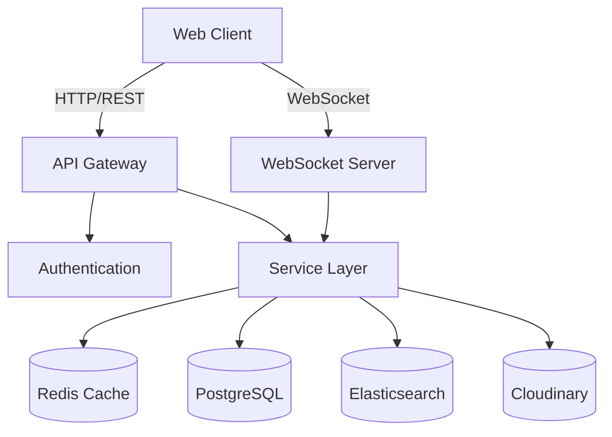
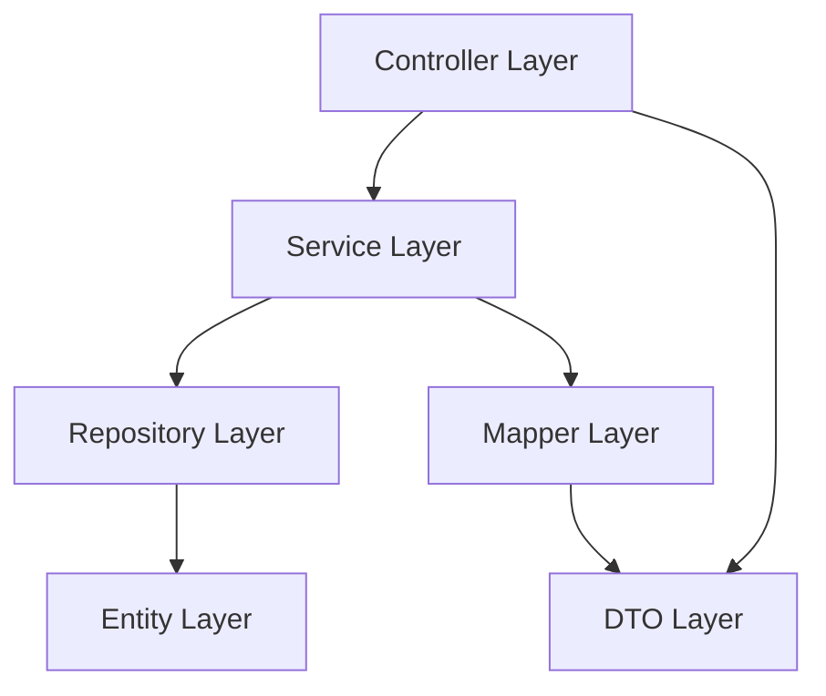
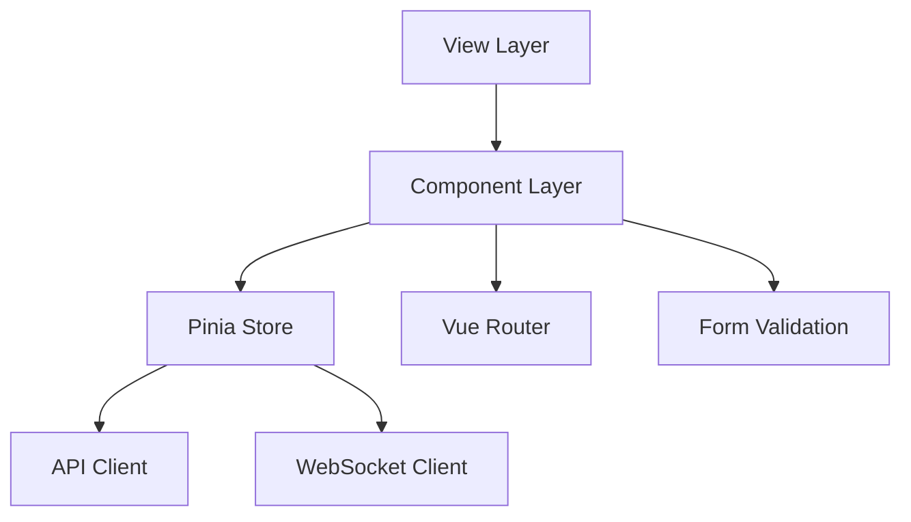
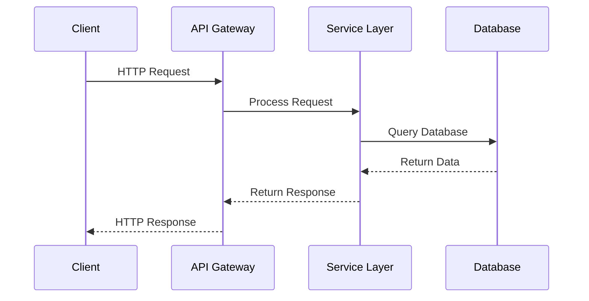

# IDATT2105 - Semester Project 2025

**Project Description:**   

A web-based marketplace platform inspired by finn.no, developed as part of the IDATT2105 Full-stack Application Development course in Spring 2025. 
The platform allows users to buy and sell items through a rich user interface, equipped with features like advanced filtering, full-text search, messaging between users. 
The system supports both standard users and administrators, where the former can list and manage items, while the latter have access to category and user management. 
The frontend is built with Vue 3, while the backend is implemented using Java 21 and Spring Boot 3, with MySQL/H2 as the database engine during development,
which is then migrated to PostReg SQL during deployment with Heroku.

The project emphasizes clean architecture, modern security practices, accessibility, and test coverage, and is delivered with CI/CD pipelines and full documentation.


**Link to application (optional):**  
Insert link here (when available).

## Table of Contents
1. [Introduction](#introduction)
2. [Technology Choices and Justifications](#technology-choices-and-justifications)
3. [Application Structure](#application-structure)
4. [Security and Authentication](#security-and-authentication)
5. [API Documentation](#api-documentation)
6. [Installation and Running](#installation-and-running)
7. [Testing and CI/CD](#testing-and-cicd)
8. [Usage Examples](#usage-examples)
9. [Project Members](#project-members)

## Introduction
Explain what the project is about and what it aims to solve. Consider including:

- - Background of the project

  The digital marketplace is a well-established concept, yet there is always room for improving user experience, security, and functionality. 
  This project aims to recreate and modernize the core concept of a platform like finn.no – allowing users to list, search for, and buy second-hand or new items – while also emphasizing best practices in full-stack development.

  This project was developed in the context of the IDATT2105 course, where students are tasked with creating a complete full-stack web application using modern technologies. 
  The project is also a voluntary assignment for students seeking to improve their course grade from a C to a B or A, and thus requires high quality in all aspects: code, UI/UX, functionality, security, testing, and documentation.

- Main functionalities

## Core Functionalities

### User Management & Authentication
- 👤 User registration and profile management
- 🔐 Secure login with JWT and Spring Security
- 👥 Role-based access control (Admin/Standard users)
- 🌐 Internationalization (i18n) support

### Listing Management
- 📝 Create, update, delete, and archive item listings
- 📸 Multi-image gallery support for listings
- 📱 Responsive thumbnail grid for item exploration

### Search & Discovery
- 🔍 Advanced filtering system
  - Category-based filtering
  - Location-based search
  - Keyword search
  - Date range filtering
- 📊 Smart sorting options
- 🗺️ Interactive map view for geographical browsing

### User Interaction
- 💬 Real-time messaging system between buyers and sellers
- ❤️ Favorites/Bookmarking system for items
- 💳 VIPPS payment simulation for transactions
- 📨 Email notifications for important updates

### Admin Features
- 🎛️ Comprehensive admin dashboard
- 📁 Category management system
- 👥 User management and moderation
- 📊 Basic analytics and reporting

### Technical Features
- 🔒 Secure authentication with JWT?
- 📱 Mobile-responsive design
- 🔄 CI/CD pipeline with >50% test coverage
- 📚 REST API with RestDocs documentation
- 🛡️ OWASP security compliance

## Technology Choices and Justifications
Comment and edit:

### Database Architecture
- **Development Environment: H2 Database**
  - light-weight in-file database perfect for development and testing
  - No separate installation required
  - Automatic schema creation and fast startup
  - Supports both SQL mode and JPA operations

- **Production Environment: PostgreSQL on Heroku**
  - Enterprise-grade reliability and performance
  - Excellent support for JSON data types
  - Automatic backups and monitoring through Heroku
  - Seamless scaling capabilities

- **Data Access Layer** --- Dobbelsjekk
  - Spring Data JPA for ORM functionality
  - Type-safe queries using JPA Criteria API
  - Prepared statements to prevent SQL injection
  - Custom repository implementations for complex queries
  - Database migration handled by Flyway


  ### Security Architecture

- **Authentication**
  - JWT-based stateless authentication
  - Refresh token rotation
  - Secure token storage in HttpOnly cookies
  - Role-based access control (RBAC)

- **API Security**
  - CORS configuration with specific origins
  - CSRF protection for state-changing operations
  - Rate limiting for API endpoints
  - Request validation using DTOs

- **Data Protection**
  - Password hashing with BCrypt
  - Input sanitization
  - XSS protection headers
  - Content Security Policy (CSP)
  - Secure file upload handling


  ### Real-time Communication

- **WebSocket Implementation**
  - STOMP protocol over WebSocket
  - SockJS fallback for legacy browsers
  - Message broker for scalable communication
  - Real-time updates for: --- dobbelsjekk
    - Chat messages
    - Listing status changes
    - Price updates
    - Notification delivery

### Deployment Infrastructure

- **Backend Deployment: Heroku**
  - Automated deployment through Git integration
  - Built-in SSL/TLS security
  - Automatic load balancing
  - Easy environment variable management
  - Integrated logging and monitoring
  - Dyno-based scaling for cost efficiency

- **Frontend Deployment: Netlify**
  - Continuous deployment from Git
  - Automatic build optimization
  - Global CDN distribution
  - Built-in form handling
  - Instant cache invalidation

## Application Structure

### Backend Architecture
The backend follows a clean, layered architecture with clear separation of concerns:

```
backend/
├── src/main/java/stud/ntnu/no/backend/
│   ├── category/           # Category management
│   ├── user/              # User management
│   ├── item/              # Item listings
│   ├── message/           # Messaging system
│   ├── transaction/       # Transaction handling
│   ├── review/            # Review system
│   ├── favorite/          # Favorites/bookmarks
│   ├── location/          # Location services
│   ├── itemimage/         # Image handling
│   ├── shippingoption/    # Shipping options
│   └── common/            # Shared utilities
```

Each feature package contains:
- `controller/` - REST endpoints and request handling
- `service/` - Business logic implementation
- `repository/` - Data access layer
- `entity/` - Database entities
- `dto/` - Data Transfer Objects
- `exception/` - Custom exceptions
- `mapper/` - MapStruct mappers for entity-DTO conversion


# Legg til diagrammer overordnet og så internt

### Frontend Architecture
The frontend is built with Vue 3 and follows a modern component-based architecture:

```
frontend/
├── src/
│   ├── api/              # API client and endpoints
│   ├── assets/           # Static assets
│   ├── components/       # Reusable Vue components
│   ├── router/           # Vue Router configuration
│   ├── stores/           # Pinia state management
│   ├── types/            # TypeScript type definitions
│   ├── utils/            # Utility functions
│   ├── views/            # Page components
│   ├── websocket/        # WebSocket integration
│   └── __tests__/        # Test files
```

### Key Architectural Decisions
1. **Backend**
   - Spring Boot 3.4.4 with Java 21
   - JPA for data access
   - H2 for development, PostgreSQL for production
   - Cloudinary for image management
   - REST API with Spring REST Docs
   - WebSocket with SockJS/STOMP
   - JWT for authentication

2. **Frontend**
   - Vue 3.5.13 with Composition API
   - Vite 6.2.5 for build tooling
   - TypeScript 5.8 for type safety
   - Pinia for state management
   - Vue Router for navigation
   - SockJS/StompJS for WebSocket
   - Vee-validate/Yup for form validation

3. **Testing**
   - Controller tests with Spring REST Docs
   - Service layer unit tests
   - Frontend component tests with Vitest
   - E2E tests with Cypress

### Architecture Diagrams

#### High-Level System Architecture


#### Backend Layer Architecture


#### Frontend Architecture


#### Data Flow Architecture


## API Documentation

Our API documentation is automatically generated using Spring REST Docs, which ensures that the documentation stays in sync with the actual code through test-driven documentation.

### Implementation Overview

1. **Test-Driven Documentation**
   - Documentation is generated through controller tests
   - Each endpoint's documentation is verified during test execution
   - Examples are automatically generated from actual request/response pairs

2. **Documentation Structure**
   ```
   backend/
   ├── src/test/java/
   │   └── .../*ControllerTest.java    # Test files that generate docs
   ├── target/generated-snippets/      # Generated documentation snippets
   └── index.adoc                      # Main documentation file
   ```

3. **Example Documentation Test**
   ```java
   @Test
   void getTopFiveCategories_ShouldReturnListOfCategories() throws Exception {
       mockMvc.perform(get("/api/categories/top-five"))
           .andDo(document("categories-top-five",
               responseFields(
                   fieldWithPath("[].id").description("Category ID"),
                   fieldWithPath("[].name").description("Category name"),
                   // ... other fields
               )
           ));
   }
   ```

### Documentation Generation Process

1. **Test Execution**: Run tests
   ```
   mvn test
   ```

2. **Snippet Generation**: Tests generate documentation snippets in `target/generated-snippets/`

3. **Index Generation**: Python script combines snippets into final documentation
   ```bash
   python generate_index.py
   ```
### Documentation Content
- Request/response formats with examples
- Detailed field descriptions and types
- Sample request/response payloads
- HTTP status codes and their meanings
- Authentication requirements per endpoint

### Accessing Documentation

The documentation can be accessed through the index.pdf file

## Installation and Running

### Prerequisites
- Java JDK 21
- Node.js v18+
- MySQL 8.0
- Maven 3.8+

### Quick Start

1. **Clone Repository**
   ```bash
   git clone [repository-url]
   cd clozet
   ```

2. **Backend Setup**
   ```bash
   cd backend
   mvn clean install
   mvn spring-boot:run
   ```
   Backend will run on `http://localhost:8080`

3. **Frontend Setup**
   ```bash
   cd frontend
   npm install
   npm run dev
   ```
   Frontend will be available on `http://localhost:5173`

The application should now be running and accessible through your browser.

# How to run tests locally - manually with EmialProdConfig - skal gjøres

## Testing and CI/CD

### Testing Strategy

#### Backend Testing
- **Unit Tests**: JUnit 5 for testing individual components
  - Service layer business logic
  - Repository layer data access
  - Utility classes and helpers
- **Integration Tests**: Spring Test for API endpoints
  - REST controller validation
  - Database integration
  - Security configuration

#### Frontend Testing
- **Unit Tests**: Vitest
  - Component testing
  - Store testing with Pinia
  - Utility function testing
- **E2E Tests**: Cypress
  - Critical user flows
  - Integration scenarios
  - Cross-browser compatibility

### Continuous Integration/Deployment

#### Backend CI/CD Pipeline (.github/workflows/backend.yml)
1. **Build**
   - Java 21 setup with Temurin distribution
   - Maven build and compilation
   - Artifact preservation
2. **Package**
   - JAR packaging
   - Artifact upload
3. **Deployment**
   - Automatic deployment to Heroku
   - Environment configuration
   - Database migration handling

#### Frontend CI/CD Pipeline (.github/workflows/frontend.yml)
1. **Build & Quality**
   - Node.js 18 setup
   - Dependency installation
   - Code formatting (Prettier)
   - Type checking
2. **Testing**
   - Unit test execution with Vitest
   - Build artifact preservation
3. **Deployment**
   - Netlify deployment
   - Production build optimization

### Local Testing

#### Backend Testing
```bash
# Run all tests
mvn test

# Run specific test class
mvn test -Dtest=UserServiceTest

# Package with tests
mvn package
```

#### Frontend Testing
```bash
# Run unit tests
npm run test:unit

# Run unit tests with coverage
npm run test:coverage

# Run E2E tests
npm run test:e2e

# Run E2E tests in development mode
npm run test:e2e:dev
```

### Test Environment Configuration
- H2 in-memory database for backend tests
- Environment-specific configurations
- TypeScript type checking for frontend
- ESLint and Prettier for code quality

## Project Members
- Names and roles

Kevin Dennis Mazali

- pic

Kaamya Shinde

- pic
